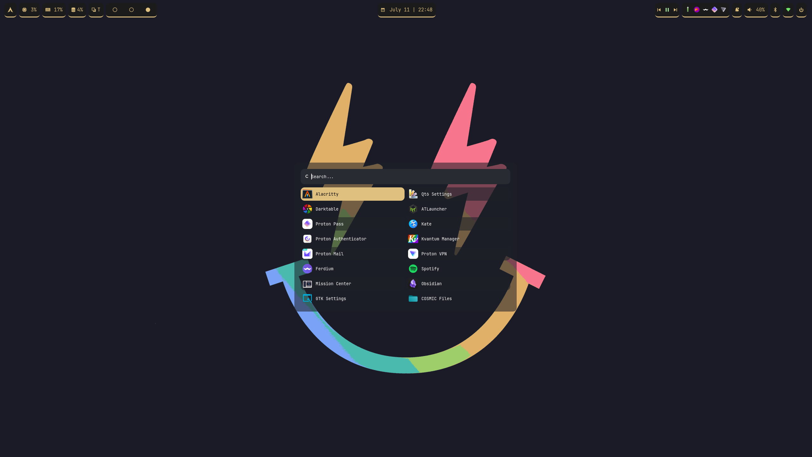

# Mango-Style
### An awsome configuration for MangoWM/MangoWC with a mostly orange theme with a hint of green :)
Made for Arch Linux (aka use with SystemD) feel free to fork it for other distros/init-systems!

 

## Modify misc.conf before using the dots!

### Full modification guide coming soon.

## Dependencies:
- mangowm (v0.15.X)
- swaync
- swaybg
- pavucontrol
- rofi
- waybar-**git**
- xdg-desktop-portal
- xdg-desktop-portal-wlr
- iwd
- cosmic-icon-theme *  
_Optional, rofi has fallback icon theme_

### Used themes:
GTK: [orchis-nord-theme](https://aur.archlinux.org/packages/orchis-nord-theme-git) _*AUR_  
QT: [kvantum-theme-orchis](https://aur.archlinux.org/packages/kvantum-theme-orchis-git) _*AUR_  
Icons: cosmic-icon-theme

## Credits:

- Wallpapers: https://github.com/atraxsrc/tokyonight-wallpapers  

- Rofi configs: https://github.com/adi1090x/rofi  
_(Heavily relied on this for configurning, included some of their themes)_
